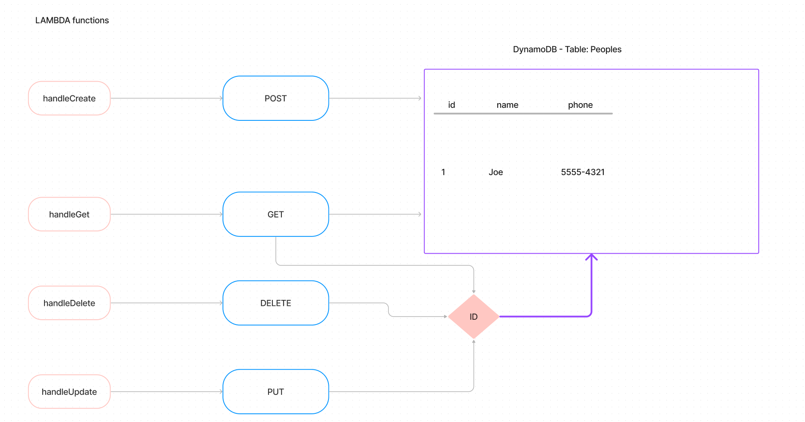

# Class - Lab 18 Serverless API

## Author: Tim Traylor

## Problem Explanation

DynamoDB used for 'peoples' database containing id/name/phone.
API Gateway updated contains routes for CRUD operations:

- GET (all / id)
- POST
- DELETE (id)
- PUT (id)

[Deployment API site](https://8s559si5o2.execute-api.us-west-2.amazonaws.com/livelive)

### Credits: Morning code review
